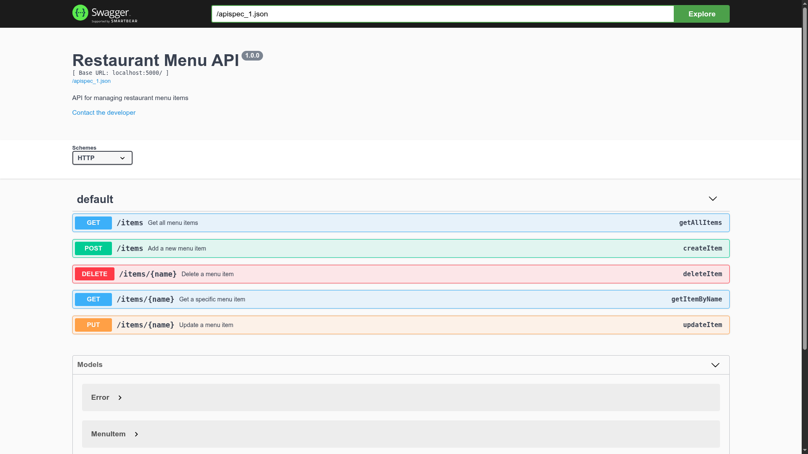

# 🍽️ Restaurant Menu API

A simple Flask-based RESTful API to manage a restaurant's menu items using PostgreSQL.

## 🚀 Features

- Add new menu items
- View all items
- Get a specific item by name
- Update an item
- Delete an item
- Swagger UI documentation included

## 🧰 Tech Stack

- Python 3.12
- Flask
- PostgreSQL
- psycopg2
- Flasgger (Swagger UI for API docs)

## 📦 Setup

1. **Clone the repository**

```bash
git clone https://github.com/yourusername/restaurant-menu-api.git
cd restaurant-menu-api
```

2. **Create a virtual environment**

```bash
python3 -m venv venv
source venv/bin/activate  # On Windows: venv\Scripts\activate
```

3. **Install dependencies**

```bash
pip install -r requirements.txt
```

4. **Configure the database**

Make sure PostgreSQL is running and create a database named:

```
restaurant_menu_ms
```

Update the DB connection settings in `DBstorage/db_utils.py` if needed.

5. **Seed the database (optional)**

You can use a seed script or manually insert records into your `menu_items` table.

## ▶️ Run the API

```bash
flask run
```

## 📘 API Documentation

Here's what the API documentation looks like:



After running the server, visit:

```
http://localhost:5000/apidocs/
```

To explore and test the API via Swagger UI.

## 📂 Project Structure

```
.
├── DBstorage/
│   ├── db_utils.py
│   ├── menu_item.py
│   └── menu_manager.py
├── swagger.yaml
├── app.py
├── requirements.txt
└── README.md
```

## 📮 Example Endpoints

- `GET /items` – Get all items
- `POST /items` – Create an item
- `GET /items/<name>` – Get an item by name
- `PUT /items/<name>` – Update an item
- `DELETE /items/<name>` – Delete an item

> For names with spaces, use underscores in the URL (e.g., `/items/Grilled_Chicken`)

---

## 📄 License

MIT License © 2025 Mouad khanouch
